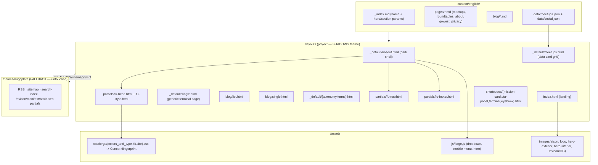

# feat: Migrate site to the Forge Utah terminal design system

## Summary

Replace the current light Hugoplate/Tailwind look with the new **terminal / 8-bit dark
design system** (`colors_and_type.css` + marketing `kit.css`) across the whole site, matching
the imported Claude Design prototype (project `5b516822-…`, files `Forge Utah Landing.dc.html`,
`Meetups.dc.html`, `About.dc.html`, `Blog.dc.html`, `Blog Post.dc.html`, `Roundtables.dc.html`,
`Go West Conference.dc.html`).

The redesign is **presentation-only**: existing content (blog posts, page copy) is preserved.
Templates are added at the **project level** (`/layouts`, `/assets`), which shadow the
`hugoplate` theme via Hugo's lookup order; the theme stays in place as fallback for plumbing
(RSS, sitemap, search index, SEO/favicon/manifest partials). The prototype's JS runtime
(`_ds_bundle.js`, `support.js`, `image-slot.js`) is **not** ported — its interactions
(community dropdown, mobile menu, interactive hero) are reimplemented in a small vanilla-JS file.

The site becomes **dark-only** (the design has no light mode), so the theme switcher and light
palette are removed.

**Product Contract preservation:** N/A — solo plan bootstrapped from the design import; no
upstream brainstorm/requirements doc. Design prototype files are the source of truth for visuals.

---

## Problem Frame

The live site runs on the `hugoplate` starter theme: Tailwind + SCSS, light/dark toggle,
`container/row` grid, generic marketing layout. The Forge team commissioned a distinctive brand
look — a monospace-forward, near-black terminal aesthetic with a red "flame" accent
(`#C04058`), pixel/CRT display fonts, dot-grid and scanline textures, and terminal-panel
motifs. That design now exists as a Claude Design prototype and a standalone CSS design system.

We need to land that design on the real Hugo site without rewriting content and without
destabilizing the build. The gap is entirely in the **template + CSS + JS layer**:

- The prototype is built with a proprietary prototype runtime (`<x-dc>`, `DCLogic`, `sc-if`,
  `sc-for`, `style-hover`, `{{ }}` bindings) that has no place in a Hugo site.
- The prototype uses heavy **inline styles** plus non-standard `style-hover` attributes; real
  hover/focus states must be extracted into CSS.
- Prototype nav links point at `*.dc.html` filenames; they must map to Hugo permalinks.
- The design shows data (meetup cards, blog list) that must be sourced from Hugo content/data,
  not the prototype's hardcoded arrays.

**Non-goals:** no live event/meetup API (the prototype's event data is illustrative — the site
defers to the external `utahtechcalendar.com` / `utahdev.events` calendar); no port of the
design's unused `events-table` component; no light-mode support.

---

## Requirements

Traceable to the design prototype and the intake decisions.

- **R1** — Apply the terminal dark design system (`colors_and_type.css` tokens + marketing
  `kit.css` components) sitewide as the canonical styling.
- **R2** — Shared sticky terminal **nav**: brand mark, links (about, community dropdown →
  meetups/roundtables/Go West, utah tech calendar, blog), Slack CTA, mobile menu, active-state
  highlighting per current page.
- **R3** — Shared three-column **footer** (community / site / connect) + meta line.
- **R4** — **Landing/home** page: interactive "clubhouse" hero (exterior↔interior cross-fade on
  door click + neon-flicker headline + CTAs + status line), about section with terminal panel,
  "three ways in" community cards, calendar CTA.
- **R5** — **Meetups** page: data-driven card grid (from `data/meetups`), recordings CTA,
  organizer CTA, breadcrumb + intro.
- **R6** — **About / Roundtables / Go West** content pages in terminal style, including the
  design's card/CTA blocks (e.g. Go West's two-goal cards), with copy sourced from content
  markdown.
- **R7** — **Blog list**: featured article card(s) + sidebar (categories, tags, CTA) +
  breadcrumb.
- **R8** — **Blog single**: breadcrumb, category/tag chips, title, author+date, hero image,
  styled prose body, tag footer, "all posts" link, CTA panel, related posts.
- **R9** — **Taxonomy** pages (`/categories/…`, `/tags/…`) styled consistently with the terminal
  theme (the design links to them).
- **R10** — Site is **dark-only**: remove the theme switcher and light palette; no visual
  regression from their removal.
- **R11** — Reimplement prototype interactions (dropdown, mobile menu, hero cross-fade) in
  **vanilla JS**; do not ship `_ds_bundle.js`, `support.js`, or `image-slot.js`.
- **R12** — Load the design's font families (JetBrains Mono / IBM Plex Mono primary, Inter body,
  Press Start 2P / VT323 display).
- **R13** — Integrate new **brand assets**: flame+cog icon (`forge-icon-color.svg`), wordmark
  logo (`forge-logo.webp`), the two hero clubhouse images, and updated favicon/OG image.
- **R14** — Update menu config and map all prototype `*.dc.html` links to real Hugo URLs.
- **R15** — **Preserve all existing content** — no copy or post loss.
- **R16** — Remove now-unused theme features from the render path (preloader, typewriter/`type.js`,
  testimonials/features home params, light-mode assets) without breaking the build.
- **R17** — Match the design's **responsive** behavior (≤980px: collapse nav to mobile menu,
  stack grids, hide search).
- **R18** — `hugo` production build passes; no broken internal links or missing assets;
  RSS/sitemap/search index still generate.

---

## Key Technical Decisions

- **KTD1 — Project-level template overrides; keep `hugoplate` as fallback.**
  New templates live under `/layouts` and shadow the theme; the theme is untouched and continues
  to serve RSS, sitemap, search index, and SEO/favicon/manifest partials. Least destructive,
  reversible, idiomatic Hugo. *(session-settled: user-directed — chosen over forking/rewriting
  the theme in place: reversibility and clean upstream diff.)* Governs R1, R2, R3.

- **KTD2 — Ship the design-system CSS directly; bypass Tailwind rather than remove it.**
  Vendor `colors_and_type.css` + `kit.css` into `assets/css/forge/` and add a project override
  sheet for what the kit doesn't cover (hover states, hero, breadcrumb, blog cards, prose, chips,
  dropdown, mobile menu). New templates use `fu-*` classes and carry no Tailwind classes. The
  Tailwind/PostCSS pipeline is left configured but off the new render path (the theme's
  `essentials/style.html` is no longer invoked by our `baseof`). Avoids a risky toolchain removal
  while making the DS canonical. Governs R1.

- **KTD3 — Dark-only; remove the theme switcher and light palette.**
  The design specifies a single dark theme. Drop `components/theme-switcher`, the `data/theme.json`
  light colors, and any `dark:` conditional styling in new templates. Governs R10.

- **KTD4 — Reimplement interactions in vanilla JS; do not port the prototype runtime.**
  `_ds_bundle.js`, `support.js`, `image-slot.js`, and the `<x-dc>`/`DCLogic`/`sc-*` constructs are
  prototype-only. Community dropdown, mobile menu, and the hero door cross-fade become ~1 small
  vanilla-JS module; neon flicker is pure CSS. `style-hover` attributes become real CSS `:hover`
  rules. Governs R11.

- **KTD5 — Editable copy in content markdown + front matter; meetup list in `data/`.**
  Landing hero/section text comes from `content/english/_index.md` front matter; About/Roundtables/
  Go West/Meetups-intro copy stays in their existing markdown; the meetup card list moves to
  `data/meetups.json`. Editors change copy without touching templates. *(session-settled:
  user-directed — chosen over hardcoding copy in templates: maintainability for volunteers.)*
  Governs R4, R5, R6.

- **KTD6 — Full interactive clubhouse hero, including exporting the two hero images.**
  Port the exterior↔interior cross-fade + clickable door hotspot + neon-flicker headline. The two
  large Gemini clubhouse images are exported from the design project into the repo. *(session-settled:
  user-directed — chosen over a simplified static hero: brand impact.)* Governs R4, R13.

- **KTD7 — Expose design card/CTA blocks as Hugo shortcodes.**
  So markdown-sourced pages (Go West two-goal cards, CTA panels) can compose design components
  without inline HTML. Scope is limited to the two components with real markdown consumers —
  `mission-card` and `cta-panel`. Terminal panels and eyebrows are rendered directly via their
  `kit.css` classes (`.fu-term`, `.fu-eyebrow`) in the templates that use them (e.g. the landing
  about section), not as shortcodes, since no page composes them from markdown. Governs R6.

- **KTD10 — Every reachable page-level template gets a terminal override; the Tailwind pipeline
  is fully off the render path.**
  Because `baseof` no longer builds the Tailwind stylesheet (KTD2), any page still served by a
  *theme* page-level template (`contact/list.html`, `authors/{list,single}.html`, `404.html`,
  section `list.html`, and section pages like About) would render inside a Tailwind-less shell and
  ship visually broken. So every reachable page-level template is either overridden with a
  terminal layout or the page/menu entry is removed. Governs R6, R7, R9, R18.

- **KTD8 — Map prototype `image-slot` placeholders to real Hugo images.**
  Blog hero images resolve from post front-matter `image` (existing `/images/forge-cloud-*.png`),
  rendered through Hugo's image handling — not the prototype's drag-drop slot. Governs R8.

- **KTD9 — Nav is config-driven where practical, static where not.**
  Top-level links + community children come from `config/_default/menus.en.toml`; the Slack CTA,
  brand, and mobile/dropdown structure live in the `fu-nav` partial. Active state derived from the
  current page. Governs R2, R14.

---

## High-Level Technical Design

**Template lookup + render pipeline** — how project overrides, the DS CSS, and shared shell fit
together. Prose is authoritative where it and the diagram differ.



**Interaction model (vanilla JS, replaces DCLogic):**

```
forge.js (deferred, on DOMContentLoaded):
  community dropdown  -> click toggle + outside-click/Escape close, aria-expanded
  mobile menu button  -> toggle panel, swap [menu]/[close] label
  hero clubhouse      -> door button click => add .is-inside on hero root
                         (CSS cross-fades exterior/interior opacity; back button reverses)
neon flicker          -> pure CSS @keyframes on the accent headline word (no JS)
```

---

## Output Structure

```
layouts/
  _default/
    baseof.html          # dark terminal shell; loads DS CSS/JS, nav, footer
    single.html          # generic terminal content page (About, Roundtables, privacy)
    meetups.html         # data-driven meetup card grid (via layout: meetups)
    taxonomy.html        # terminal-styled category/tag term pages
    terms.html           # terminal-styled taxonomy index
  index.html             # landing + interactive hero
  blog/
    list.html            # blog index + sidebar
    single.html          # blog post
  partials/
    fu-head.html         # meta/fonts/SEO (reuses theme SEO partials)
    fu-style.html        # builds + links the forge CSS bundle
    fu-nav.html          # sticky terminal nav
    fu-footer.html       # footer
    components/
      fu-blog-card.html  # terminal blog card
  shortcodes/
    mission-card.html
    cta-panel.html
assets/
  css/forge/
    colors_and_type.css  # vendored from design system (verbatim)
    kit.css              # vendored marketing kit (verbatim)
    site.css             # project overrides: hover states, hero, breadcrumb,
                         #   blog cards, .fu-prose, chips, dropdown, mobile menu
  js/
    forge.js             # dropdown + mobile menu + hero interactions
  # also: _default/list.html, contact/list.html, 404.html (terminal overrides
  #   so no reachable page falls back to a Tailwind-less theme template)
  images/
    forge-icon-color.svg
    forge-logo.webp
    hero-clubhouse-exterior.png
    hero-clubhouse-interior.png
    favicon / og-image (updated)
data/
  meetups.json           # meetup card list
```

The per-unit **Files** lists remain authoritative; the tree is the intended shape.

---

## Implementation Units

### U1. Design-system CSS + asset foundation

**Goal:** Vendor the design system, add the project override sheet, and bring in brand/hero
assets so later units have styling and images to reference.

**Requirements:** R1, R12, R13.

**Dependencies:** none.

**Files:**
- `assets/css/forge/colors_and_type.css` (create — vendored verbatim from design system)
- `assets/css/forge/kit.css` (create — vendored verbatim from marketing kit)
- `assets/css/forge/site.css` (create — project overrides)
- `assets/images/forge-icon-color.svg` (create — export from design project `assets/`)
- `assets/images/forge-logo.webp` (create — export from design project `assets/`)
- `assets/images/hero-clubhouse-exterior.png` (create — export from design project
  `uploads/Gemini_Generated_Image_nfk7bfnfk7bfnfk7.png`)
- `assets/images/hero-clubhouse-interior.png` (create — export from design project
  `uploads/Gemini_Generated_Image_45jnhk45jnhk45jn.png`)

**Approach:**
1. Export the design-system and asset files from the Claude Design project via the DesignSync
   `get_file` read method (binary assets come back base64 — decode to disk). **Export the two
   Gemini hero PNGs first as a gate:** `get_file` is capped at **256 KiB per file**, and Gemini
   hero images routinely exceed that. If either export is rejected for size or returns
   non-decodable data, obtain the source images another way (they originate as user uploads — ask
   the user for the originals) or downscale/re-encode them inside the design project before
   export. The interactive hero (KTD6) is load-bearing for U3, so resolve this before proceeding.
   Once in the repo, run the hero images through Hugo image processing (`resize`/WebP) to keep the
   hero light. Keep `colors_and_type.css` and `kit.css` **verbatim** so future design-system
   updates re-vendor cleanly; do all site-specific tweaks in `site.css`.
2. `site.css` supplies what the prototype expressed as inline styles / non-standard `style-hover`:
   real `:hover`/`:focus-visible` states for nav links, dropdown items, cards, buttons, links;
   the landing hero (breadcrumb, hero image stack, gradients, neon headline word, status line);
   blog cards + featured card; `.fu-prose` styling for rendered markdown (headings in mono,
   body in sans, links in cyan, `code`/`pre`, blockquote, lists, images); category/tag chips;
   breadcrumb; mobile menu panel; community dropdown.
3. Confirm the fonts: `colors_and_type.css` already `@import`s the Google Fonts URL. Keep it for
   now (a later optimization can move it to a preconnect `<link>`); note it in Open Questions.
4. Reference exact color/spacing tokens from `colors_and_type.css` (`--accent`, `--bg`, `--border`,
   `--font-mono`, etc.) in `site.css` — never hardcode hex that the tokens already define.

**Patterns to follow:** the `fu-*` class naming and token usage already established in
`kit.css`; extend, don't fork.

**Test scenarios:**
- Test expectation: visual/build only — no behavioral logic in this unit. Verified via U3–U8
  rendering and the U8 build gate. Confirm the three CSS files compile through Hugo's pipeline
  without PostCSS errors and the four image assets resolve (no 404) once referenced.

**Verification:** `hugo` builds with the new assets present; a scratch template linking the forge
bundle renders dark with mono type and the flame accent.

---

### U2. Base shell — `baseof`, head/style, nav, footer, interactions JS

**Goal:** The dark terminal shell every page renders inside, plus the shared nav/footer partials
and the vanilla-JS interaction module. This is the backbone for all page units.

**Requirements:** R2, R3, R10, R11, R14, R17.

**Dependencies:** U1.

**Files:**
- `layouts/_default/baseof.html` (create — shadows theme baseof)
- `layouts/partials/fu-head.html` (create)
- `layouts/partials/fu-style.html` (create — builds/links the forge CSS bundle)
- `layouts/partials/fu-nav.html` (create)
- `layouts/partials/fu-footer.html` (create)
- `assets/js/forge.js` (create)
- `config/_default/menus.en.toml` (modify — reconcile nav; see U7)

**Approach:**
1. `baseof.html`: dark `<html>`/`<body class="fu-root fu-app">` shell. Head via `fu-head`
   (reuse the theme's `basic-seo.html`, `favicon`, `manifest`, `search-index.html`,
   Google Analytics, GTM partials — they still work through the theme fallback) + `fu-style`.
   Body renders `fu-nav`, `{{ block "main" . }}`, `fu-footer`, then `forge.js` (deferred). **Do
   not** invoke the theme's `essentials/style.html` (Tailwind), `preloader`, `theme-switcher`,
   or `tw-size-indicator`.
2. `fu-style.html`: `resources.Get` the three `css/forge/*.css`, `resources.Concat` →
   `minify | fingerprint | resources.PostProcess` in production (mirror the pattern in the
   theme's `essentials/style.html`, lines 52–72, but for the forge bundle only).
3. `fu-nav.html`: sticky nav from `kit.css` `.fu-nav`. Brand (`forge-icon-color.svg` +
   `forge.utah` wordmark) links home. Desktop links from `site.Menus.main`; the "community"
   parent renders a JS dropdown of its children. Slack CTA button (external). Mobile `[ menu ]`
   button toggles a stacked panel. Active state: compare menu URL to current page (mirror the
   active logic in the theme header, `essentials/header.html` lines 33–96, but with `fu-*`
   classes and `is-active`). Map every prototype `*.dc.html` href to the real Hugo permalink.
4. `fu-footer.html`: three columns (community/site/connect) + meta line, per the prototype
   footer (identical across all design pages). The footer brand block renders the wordmark
   `assets/images/forge-logo.webp` (this is the sole consumer of that asset from R13; the nav
   brand uses the `forge-icon-color.svg` mark + text wordmark). Links use real URLs.
5. `forge.js`: `DOMContentLoaded` handlers for the community dropdown, mobile menu, and the hero
   door (delegated — only acts if a hero root is present). No dependency on any prototype runtime.
   - **Dropdown = ARIA menu-button pattern:** toggle sets `aria-expanded`; on open, move focus to
     the first item; Up/Down cycle items; Escape closes and returns focus to the toggle;
     outside-click closes.
   - **Mobile menu:** toggle + `[ menu ]`/`[ close ]` label swap. The `community` parent renders
     in the mobile panel as an **always-expanded group** with its three children as indented
     links (no nested toggle), so every destination is one tap away and nothing is dropdown-gated.
6. Responsive: rely on `kit.css` `@media (max-width:980px)` (hides `.fu-nav-links`/`.fu-search`);
   `site.css` shows the mobile button and styles the panel below 980px.

**Execution note:** Build one non-home page against this shell early (e.g. a stub `single.html`)
to prove nav/footer/JS before fanning out to every page unit.

**Patterns to follow:** theme `_default/baseof.html` (block structure), `essentials/header.html`
(menu iteration + active logic), `essentials/style.html` (asset pipeline).

**Test scenarios:**
- Nav renders all top-level items from `menus.en.toml`; the current section's item shows
  `is-active`.
- Community dropdown: click opens it (`aria-expanded=true`); on open focus moves to the first
  item; Up/Down cycle items; outside click and Escape close it and Escape returns focus to the
  toggle.
- Mobile panel (≤980px): the `community` group is always-expanded with its three children as
  indented links — Meetups/Roundtables/Go West are each reachable in one tap (no dropdown gate).
- Mobile menu (viewport ≤980px): `[ menu ]` toggles the panel and swaps to `[ close ]`; links
  navigate and close the panel.
- Footer renders three columns with correct external URLs (Slack, YouTube, GitHub, X, LinkedIn,
  mailto).
- Slack CTA is an external link with correct href.
- Keyboard: dropdown and mobile toggles are focusable and operable by keyboard; `Escape` closes.
- `forge.js` no-ops gracefully on pages without a hero (no console error).

**Verification:** every page inherits the sticky dark nav + footer; interactions work with JS on;
with JS off, links still resolve (dropdown children reachable via the mobile panel / direct URLs).

---

### U3. Landing page with interactive clubhouse hero

**Goal:** The home page — the design's centerpiece — with the exterior↔interior hero, about +
terminal panel, community cards, and calendar CTA.

**Requirements:** R4, R11, R13, R15.

**Dependencies:** U2.

**Files:**
- `layouts/index.html` (create — shadows theme `index.html`)
- `content/english/_index.md` (modify — replace Hugoplate banner/features params with
  redesign front matter: hero eyebrow/title/accent-word/sub/CTAs/status, about copy, community
  card copy, calendar CTA copy)
- `assets/js/forge.js` (modify — hero cross-fade, from U2 scaffold)
- `assets/css/forge/site.css` (modify — hero-specific styles, from U1)

**Approach:**
1. `index.html` renders, in order: hero `<header>` (image stack: exterior + interior absolutely
   stacked, gradient overlays, door hotspot button, optional "back outside" button, eyebrow,
   neon headline with accent word, CTAs, status line), about `<section>` (prose + `.fu-term`
   terminal panel), community `<section>` (three `.fu-mission-card`s → Meetups/Roundtables/
   Go West), calendar CTA `<section>`.
2. Source copy from `_index.md` front matter (hero title, accent word, sub, status items,
   about paragraphs, three card blurbs, calendar blurb) per KTD5. Preserve the current site's
   intent (the existing banner already says "Utah's community for …").
3. Hero interaction: door button toggles `.is-inside` on the hero root; `site.css` cross-fades
   the two images' opacity and swaps the door/back buttons; neon flicker is a CSS `@keyframes`
   on the accent word. Reduce motion: gate flicker/transition behind
   `@media (prefers-reduced-motion: no-preference)`.
   - **Discoverability affordance (required):** the door hotspot must visibly signal it is
     interactive — `cursor: pointer` plus a persistent cue (e.g. a subtle pulsing outline/glow and
     a `> step inside` label near the door), so first-time visitors discover the interior view the
     two exported images exist for. The pulse respects `prefers-reduced-motion`.
4. Replace the prototype's `utahdev.events` calendar link with the site's canonical calendar URL
   (see U7 / Open Questions on `utahtechcalendar.com` vs `utahdev.events`).
5. Remove reliance on `type.js` typewriter (the redesign uses a static neon word, not typed
   strings).

**Technical design (directional):** hero image stack is two `position:absolute; inset:0`
``s; `.is-inside` sets `--exterior-opacity:0; --interior-opacity:1` (CSS custom props the
imgs read), transition `opacity 900ms`. Not implementation-final.

**Patterns to follow:** `Forge Utah Landing.dc.html` (structure/copy), `kit.css` `.fu-hero*`,
`.fu-mission*`, `.fu-term*`, `.fu-footer`.

**Test scenarios:**
- Home renders hero, about+terminal, three community cards, calendar CTA, footer in order.
- The door hotspot shows a visible affordance (cursor pointer + persistent cue/label) before any
  interaction, so it reads as clickable.
- Door click cross-fades exterior→interior and reveals the "back outside" control; back button
  reverses it.
- With `prefers-reduced-motion: reduce`, the neon flicker and cross-fade are disabled/instant.
- Hero headline accent word uses the flame color; CTAs link to Slack and the calendar.
- Community cards link to `/meetups/`, `/roundtables/`, `/gowest/` (real permalinks).
- Copy comes from `_index.md` front matter (change a value → it changes on the page).
- Both hero images load and are responsive (no horizontal page scroll at 375px, 768px, 1280px).
- Hero has an accessible name for the door control (`aria-label`), and images have meaningful
  `alt`.

**Verification:** landing matches the prototype visually; interaction works; Lighthouse shows no
layout shift from the image swap; no console errors.

---

### U4. Generic terminal content page + design-component shortcodes

**Goal:** A reusable single-page layout for prose pages, plus shortcodes so markdown can compose
the design's cards/CTAs. Covers About, Roundtables, Go West, privacy policy.

**Requirements:** R6, R15.

**Dependencies:** U2.

**Files:**
- `layouts/_default/single.html` (create)
- `layouts/shortcodes/mission-card.html` (create)
- `layouts/shortcodes/cta-panel.html` (create)
- `content/english/pages/roundtables.md` (modify — add front-matter subtitle; wrap card/CTA
  blocks in shortcodes as desired)
- `content/english/pages/gowest.md` or `content/english/pages/events.md` (verify/modify — Go West
  page: two-goal `mission-card`s + `GoWestConf.com` CTA panel; confirm the content file/slug)
- `content/english/pages/about.md` (create — relocate About from the section page below into the
  `pages` bundle so it routes through `_default/single.html`)
- `content/english/about/_index.md` (delete/relocate — currently a **section** page; see Approach)

**Approach:**
1. `single.html`: breadcrumb (`home / <section>`), `<h1>` (title), optional subtitle
   (`.Params.subtitle` or `.Params.description`), then `.fu-prose`-wrapped `{{ .Content }}`.
   `.fu-prose` (from U1) styles all rendered markdown elements so page bodies need no inline
   styling.
2. Shortcodes expose the two design blocks that pages compose from markdown: `mission-card`
   (prompt label + title + body + optional link) and `cta-panel` (heading + blurb + button).
   Editors drop these into markdown to reproduce the Go West two-goal cards and the CTA panels
   without raw HTML. Terminal panels and eyebrows are template-only (rendered via `.fu-term` /
   `.fu-eyebrow` where used) — no shortcode, per KTD7.
3. **About is a section page today** (`content/english/about/_index.md`, `Kind=section`).
   `_default/single.html` only serves `Kind=page`, and Hugo's section lookup would pick the
   theme's `about/list.html` (Tailwind) — which renders unstyled under the Tailwind-off shell
   (KTD10). Relocate About to `content/english/pages/about.md` (slug `about`), which routes
   through `_default/single.html` and still resolves at `/about/` via the existing
   `[permalinks.page] pages = "/:slugorfilename/"` rule. Preserve all existing About prose.
4. Confirm the Go West content source and permalink. The menu points to `/gowest/`; today there
   is `content/english/pages/events.md` ("Tech Events / Coming Soon") and `roundtables.md`, but no
   `gowest.md`. Create/relocate a `gowest.md` (slug `gowest`) carrying the design's Go West copy,
   preserving any existing Go West content if present elsewhere.
5. Keep all existing prose from About and `roundtables.md` (R15); only add front matter and
   optional shortcode wrappers.

**Patterns to follow:** `About.dc.html`, `Roundtables.dc.html`, `Go West Conference.dc.html`
(structure/copy); theme `_default/single.html` (front-matter access) but restyled with `fu-*`.

**Test scenarios:**
- About resolves at `/about/`, routes through `_default/single.html` (not the theme's
  `about/list.html`), and renders breadcrumb + title + subtitle + prose in terminal style; all
  original paragraphs present (R15).
- Roundtables renders its two pilot entries; links (proposal doc, contacts) intact.
- Go West renders the two-goal `mission-card`s and the `GoWestConf.com` CTA panel; page resolves
  at `/gowest/` and the community dropdown + card link reach it.
- `mission-card` shortcode: with and without a link renders correctly; escapes user text.
- `cta-panel` shortcode: heading/blurb/button render; button href respected.
- `.fu-prose` styles headings (mono), body (sans), links (cyan), lists, `code`, blockquote,
  images — spot-check against a page containing each.
- Privacy policy page renders through the same layout without card/CTA shortcodes.

**Verification:** all four content pages render in terminal style with no lost copy and no inline
`<style>` in the markdown.

---

### U5. Meetups page (data-driven card grid)

**Goal:** The Meetups page as a card grid sourced from a data file, plus recordings and organizer
CTAs.

**Requirements:** R5, R15.

**Dependencies:** U2, U4 (shortcodes/prose available; not strictly blocking).

**Files:**
- `data/meetups.json` (create — the meetup list currently in `meetups.md` + the prototype array)
- `layouts/_default/meetups.html` (create)
- `content/english/pages/meetups.md` (modify — `layout: meetups` + intro copy in front matter /
  body; the link list moves to `data/meetups.json`)

**Approach:**
1. `data/meetups.json`: array of `{ slug, name, host, url }` for the 8 meetups (Utah Go, Utah
   Kubernetes, UDEM, Women Who Go Utah, AI Utah, Engineering Leadership Utah, St George
   Developers, The Foundry Hack Nights). Merge the current `meetups.md` list (which includes
   "Women Who Go Utah") with the prototype's array; the current markdown is the authoritative set
   (R15) — keep all 8.
2. `meetups.html` (selected via `layout: meetups` front matter): breadcrumb + title + intro,
   then a `repeat(auto-fill, minmax(300px,1fr))` grid of `.fu-mission-card` links from
   `site.Data.meetups`, then the recordings CTA (YouTube) and organizer CTA (Google Doc) panels.
3. Intro copy and the two CTA blurbs live in `meetups.md` front matter (KTD5).

**Patterns to follow:** `Meetups.dc.html` (card grid + CTA panels); `data/social.json` (existing
data-file shape); `kit.css` `.fu-mission-card`.

**Test scenarios:**
- Grid renders one card per entry in `data/meetups.json`; each card shows slug prompt, name, host
  and links to the correct external `url`.
- All 8 current meetups appear (explicitly assert "Women Who Go Utah" is not dropped — R15).
- Recordings CTA links to the Forge YouTube; organizer CTA links to the organizer Google Doc.
- Adding an entry to `data/meetups.json` adds a card (data-driven, no template edit).
- Breadcrumb + intro copy render from front matter.
- Grid is responsive (single column on mobile, multi-column ≥980px).

**Verification:** meetups page matches the prototype; editing the data file changes the grid.

---

### U6. Blog list, single, card, and taxonomy pages

**Goal:** Terminal-styled blog index (with sidebar), blog post, blog card, and category/tag pages.

**Requirements:** R7, R8, R9, R18, R15, KTD8, KTD10.

**Dependencies:** U2 (`.fu-prose` comes from U1, available transitively through U2; U6 does not
use U4's shortcodes).

**Files:**
- `layouts/blog/list.html` (create)
- `layouts/blog/single.html` (create)
- `layouts/partials/components/fu-blog-card.html` (create)
- `layouts/_default/taxonomy.html` (create — term pages: `/categories/technology/`, `/tags/cloud/`)
- `layouts/_default/terms.html` (create — taxonomy index)
- `layouts/_default/list.html` (create — terminal fallback for any section list, e.g. authors)
- `layouts/contact/list.html` (create — terminal contact page; footer-linked)
- `layouts/404.html` (create — terminal 404)
- `assets/css/forge/site.css` (modify — blog card / featured card / sidebar / chip styles)

**Approach:**
1. `blog/list.html`: breadcrumb + title + intro; main column of `fu-blog-card`s with a sticky
   sidebar (Categories with counts, Tags chips, "write for us" Slack CTA); preserve pagination
   (`.Paginate`). **Low-count states (the site ships with one post today):** when exactly one
   non-draft post exists, render it as a normal card — *skip* the featured treatment so there is
   no featured card above an empty column; the featured treatment applies only when 2+ posts
   exist. When zero non-draft posts exist, show a terminal-styled empty message
   (`$ no posts yet ▮`) instead of an empty grid.
2. `blog/single.html`: breadcrumb (`home / blog / <slug>`), category/tag chips, title,
   author + `PublishDate`, hero image (from front-matter `image`, via Hugo image handling —
   KTD8, not the prototype `image-slot`; **guard with `{{ with .Params.image }}`** so a post
   without an `image` renders without erroring), `.fu-prose` body, tag footer, "← all posts"
   link, CTA panel, and related posts (reuse the theme's related-posts query from
   `blog/single.html` lines 73–87, restyled with `fu-blog-card`).
3. `fu-blog-card.html`: terminal card — image, category chips, title link, `$ author`, summary,
   "read more →". Replaces the theme's `components/blog-card`.
4. `taxonomy.html` / `terms.html`: terminal-styled lists so `/categories/…` and `/tags/…`
   (linked from the blog sidebar and post chips) don't fall back to the Tailwind theme look (R9).
5. Author links: the prototype shows `$ Clint Berry` without linking to an author page; render
   author as plain text to match the design, and ensure no broken author URLs remain referenced.
6. **Override remaining reachable page-level templates (KTD10):** create a terminal
   `_default/list.html` (covers author archives and any other section list), a terminal
   `contact/list.html` (the Contact page is footer-linked), and a terminal `404.html`, so no
   reachable page falls back to a Tailwind theme template under the Tailwind-off shell. If a page
   (e.g. author archives) is not wanted in the redesign, remove its menu entry / content instead
   of styling it — decide per page in U7.

**Patterns to follow:** `Blog.dc.html`, `Blog Post.dc.html`; theme `blog/list.html`,
`blog/single.html` (pagination, related-posts query, taxonomy iteration).

**Test scenarios:**
- Blog index lists all non-draft posts; the featured card appears only with 2+ posts; pagination
  renders when posts exceed the page size.
- With exactly one non-draft post (current state), the index renders that post as a normal card
  with no empty column; with zero posts, it renders the terminal empty message.
- A post lacking front-matter `image` renders without a template error (nil-image guard).
- The footer-linked Contact page and the 404 page render in terminal style (not the Tailwind
  fallback); no reachable page loads the Tailwind theme layout.
- Sidebar Categories show real counts from `site.Taxonomies`; Tags render as chips; each links to
  its term page.
- Blog single renders breadcrumb, chips, title, author+date, hero image, prose body, tag footer,
  all-posts link, CTA, and up to 3 related posts.
- The existing Forge Cloud post renders with all original body content intact (R15) and its
  `/images/forge-cloud-*.png` hero resolves (KTD8).
- Category term page (`/categories/technology/`) and tag page (`/tags/cloud/`) render in terminal
  style, listing the matching posts.
- Markdown prose in a post styles correctly via `.fu-prose` (headings, lists, `em`/`strong`,
  code).
- Draft posts remain excluded from the index and RSS.

**Verification:** blog index/post/taxonomy all render in terminal style; RSS still generates via
the theme fallback; no broken links from chips or sidebar.

---

### U7. Config, menus, brand metadata, and theme-feature cleanup

**Goal:** Reconcile site config with the redesign — menus, fonts, favicon/OG, and removal of
now-unused theme features — without breaking the build.

**Requirements:** R10, R12, R13, R14, R16, R18.

**Dependencies:** U2 (nav consumes menus); safe to do alongside U3–U6.

**Files:**
- `config/_default/menus.en.toml` (modify)
- `config/_default/params.toml` (modify — disable search/theme-switcher toggles; brand params)
- `hugo.toml` (modify — prune unused plugin CSS/JS; keep GA/GTM)
- `data/theme.json` (modify or leave dormant — light palette no longer used)
- `content/english/_index.md` (already modified in U3 — remove `features`/`testimonial` params)
- favicon / OG image assets (modify — new brand mark)

**Approach:**
1. Menus: confirm the four top-level items (About; Community → Meetups/Roundtables/Go West;
   Utah Tech Calendar; Blog) and their URLs. Fix the Go West child URL to `/gowest/` (match U4).
   Resolve the calendar URL inconsistency (`utahtechcalendar.com` in current config vs
   `utahdev.events` in the prototype landing) — see Open Questions; apply one canonical value.
2. Params: set `navbar_fixed` behavior for the sticky nav; disable `theme_switcher`/light mode
   (R10); decide on search (the prototype nav shows a search affordance but the imported pages
   don't wire it — default: hide search UI, keep the search index generating for later). Decide
   the fate of pages the redesign doesn't feature (author archives): keep them (terminal
   `_default/list.html` from U6 covers them) or delist/remove — do not leave a Tailwind fallback
   reachable (KTD10).
3. `hugo.toml`: remove plugin CSS/JS the redesign doesn't use to trim the render path —
   `type.js` (typewriter, now unused), and audit `swiper`/`glightbox`/`font-awesome` (the new
   nav/footer use text glyphs, not Font Awesome; the testimonial swiper is gone). Keep anything
   still referenced by the theme fallback partials that we still render. Remove cautiously and
   rebuild after each removal (R16, R18).
4. Favicon + OG image: regenerate from the flame+cog mark so browser tab and social cards match
   the brand (R13).
5. Leave `data/theme.json` in place if any fallback partial still reads it (the theme's
   `head.html` reads `.fonts` for the Google Fonts injection — but our `fu-head` no longer calls
   that path; verify nothing else references it before editing).

**Execution note:** Prefer smoke/build verification here over unit tests — this is config. After
each removal, run `hugo` and load the affected pages.

**Test scenarios:**
- Test expectation: build/smoke only. After config changes: `hugo` production build succeeds;
  nav renders the four items with correct URLs; no page references a removed plugin asset
  (grep the built `public/` for stale `type.js`/`font-awesome` links); favicon and OG image
  resolve; theme switcher no longer appears.

**Verification:** production build is clean and lean; nav/calendar links resolve; brand metadata
is updated.

---

### U8. Full-site QA, accessibility, and build verification

**Goal:** Prove the redesign end-to-end across pages, breakpoints, and the production build before
shipping.

**Requirements:** R17, R18, R15.

**Dependencies:** U1–U7.

**Files:**
- (verification only — fixes land in the relevant unit's files)

**Approach:**
1. Run `hugo --gc --minify` (production) and confirm zero errors/warnings that matter; confirm
   `public/` contains RSS, sitemap, and search index.
2. Crawl internal links (e.g. `hugo` + a link checker, or `htmltest`) — no broken internal links
   or missing assets; all prototype `*.dc.html` references are gone.
3. Responsive **and visual-styling** pass at 375 / 768 / 1024 / 1440px on home, meetups, blog
   list, blog post, about, roundtables, Go West, **contact, a taxonomy term page, and 404**: every
   page renders in terminal style (explicitly confirm none fell back to a Tailwind theme layout —
   the link crawl alone will not catch this), nav collapses ≤980px, grids stack, no horizontal
   scroll, hero images scale.
4. Accessibility spot-check: color contrast of body/muted text on dark surfaces meets WCAG AA
   for text; interactive controls (dropdown, mobile menu, door button) are keyboard-operable and
   labeled; images have `alt`; `prefers-reduced-motion` honored.
5. Content integrity: diff rendered page text against the pre-redesign site for each migrated page
   to confirm no copy was dropped (R15).

**Execution note:** Smoke/verification unit — no new feature tests; it exercises the whole site.

**Test scenarios:**
- `hugo` production build exits 0; RSS/sitemap/search index present.
- Link check passes (no 404s, no `.dc.html` leftovers).
- Each page renders correctly at all four breakpoints with no horizontal overflow.
- Keyboard-only walkthrough can open/close the dropdown and mobile menu and toggle the hero.
- Reduced-motion disables flicker/cross-fade animation.
- Migrated-page text matches the old site (no lost content).

**Verification:** the site ships dark, terminal-styled, responsive, accessible, and building
clean.

---

## Scope Boundaries

**In scope:** everything in R1–R18 — full presentation migration to the terminal design system
across all pages + shared shell, data-driven meetups, shortcodes for design components, vanilla-JS
interactions, brand assets, config cleanup, and QA.

### Deferred to Follow-Up Work
- Optimize font loading (move the `@import` in `colors_and_type.css` to preconnected `<link>`s
  with `font-display: swap`) — cosmetic performance, not blocking.
- Wire a real search experience into the nav search affordance (index already generates).
- Live event feed / calendar embed on-site (currently defers to the external calendar).
- Additional blog posts / the Forge Cloud series parts II–VIII (content, not this redesign).

### Outside this redesign's scope
- Any backend/API for meetups or events.
- The design system's unused `events-table` component.
- Light-mode / theme switching (removed by R10).
- Rewriting or removing the `hugoplate` theme (kept as fallback per KTD1).

---

## Risks & Dependencies

- **Asset export dependency (KTD6/R13):** the two hero images and brand SVG/webp must be exported
  from the Claude Design project (DesignSync `get_file`, base64-decoded). If the images are too
  large for a fast hero, downscale/convert to WebP via Hugo image processing. *Mitigation:* U1
  exports and (if needed) `resources` re-encodes; hero uses responsive `srcset`.
- **Tailwind-off render path (KTD2/KTD10):** because `baseof` no longer calls the theme's Tailwind
  pipeline, any page still served by a *theme page-level template* renders unstyled. This is the
  plan's biggest structural trap. Concretely affected: About (a section page — relocated to
  `pages/about.md` in U4), Contact (footer-linked), author archives, `404.html`, taxonomy pages.
  *Mitigation:* KTD10 requires a terminal override for every reachable page-level template
  (`_default/list.html`, `contact/list.html`, `404.html`, `taxonomy.html`, `terms.html` — U6) or
  removal of the page/menu entry (U7); U8's visual pass at each breakpoint (not just the link
  crawl) confirms no page loads a Tailwind layout. The partials `fu-head` reuses are `head`/SEO/
  search-index plumbing (no visible layout), so those are safe.
- **Content-source ambiguity for Go West:** no `gowest.md` exists today. *Mitigation:* U4 creates
  it at slug `gowest`, preserving any existing Go West copy; U7 aligns the menu URL.
- **Plugin removal regressions (R16):** pruning `hugo.toml` plugins risks removing something a
  retained fallback partial needs. *Mitigation:* U7 removes cautiously with a build after each
  change.

---

## Open Questions

- **Canonical calendar URL:** the prototype landing links to `utahdev.events`; the current site
  config and other prototype pages use `utahtechcalendar.com`. Which is canonical? (U3/U7 apply
  one value.) *Default if unanswered:* keep the current config value `utahtechcalendar.com`.
- **Nav search affordance:** show the prototype's search box (and wire it to the existing search
  index) or hide it for now? *Default:* hide the search UI, keep the index generating (deferred
  follow-up).
- **Author pages:** the design shows author as plain `$ Name` text. Keep author archive pages
  (theme provides them) linked, or render author as plain text? *Default:* plain text on cards/
  posts; leave author archive pages generating but unlinked from the redesigned UI.
- **Font `@import` vs `<link>`:** ship `colors_and_type.css` verbatim (render-blocking `@import`)
  now and optimize later, or move fonts to `fu-head` preconnect immediately? *Default:* verbatim
  now; optimize in follow-up.

---

## Sources & Research

- **Design prototype (source of truth):** Claude Design project `5b516822-499d-456d-83bb-e9f963b434f5`
  — `Forge Utah Landing.dc.html`, `Meetups.dc.html`, `About.dc.html`, `Blog.dc.html`,
  `Blog Post.dc.html`, `Roundtables.dc.html`, `Go West Conference.dc.html`; design system
  `_ds/forge-utah-design-system-…/colors_and_type.css` + `ui_kits/marketing/kit.css`; assets
  `assets/forge-icon-color.svg`, `assets/forge-logo.webp`, `uploads/Gemini_Generated_Image_*.png`.
  Read via the DesignSync MCP read methods.
- **Current site (repo):** `themes/hugoplate/layouts/_default/baseof.html`,
  `themes/hugoplate/layouts/partials/essentials/{head,style,header,footer,script}.html`,
  `themes/hugoplate/layouts/{index.html,blog/list.html,blog/single.html}`,
  `config/_default/menus.en.toml`, `hugo.toml`, `content/english/**`, `data/{theme,social}.json`.
- **Intake decisions (session-settled):** project-level overrides (KTD1), full interactive hero
  (KTD6), content-markdown + front-matter copy source (KTD5).
- **Hugo behaviors relied upon:** project `/layouts` shadowing theme layouts; `resources`
  pipeline (Concat/minify/fingerprint/PostProcess); `site.Data` / `data/*.json`; `layout`
  front-matter selection; taxonomy/terms templates; `.Paginate`.
