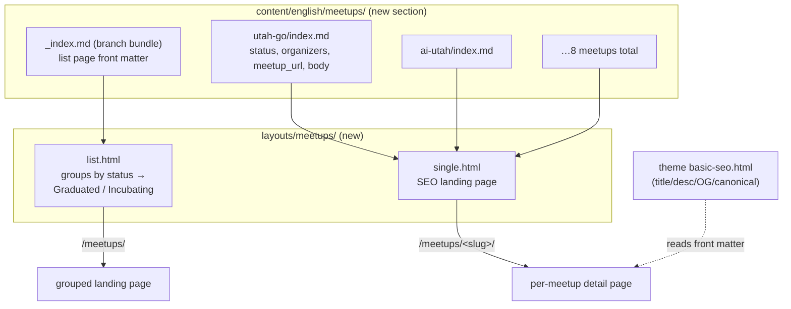

# feat: Meetups content section with per-meetup SEO landing pages

## Summary

Convert the meetups feature from a flat `data/meetups.json` list rendered on a single page into a first-class Hugo **content section** with a grouped list (landing) page and an individual SEO landing page per meetup. Each meetup becomes a page bundle carrying its own front matter (name, description, meetup URL, lifecycle `status`, and `organizers`) plus a markdown body of indexable content. Meetups are grouped into **Graduated** (established, solid user base) and **Incubating** (newer pilots) under the "Forge Sponsored Meetups" page identity.

This follows the existing `blog` list/single pattern and the terminal design system already in the repo. No live Slack integration; organizers display name + Slack handle (avatar rendering is future-proofed but off by default).

---

## Problem Frame

Today meetups are a flat JSON array (`data/meetups.json`: `slug`, `name`, `host`, `url`) rendered by one layout (`layouts/_default/meetups.html`) at `/meetups/`. Limitations:

- **No detail pages** — every card links straight off-site to meetup.com/lu.ma. Forge has zero indexable content per meetup, so there is no SEO surface for "Utah Go User Group", "AI Utah", etc.
- **No grouping** — no way to distinguish established meetups from pilots.
- **No organizer info** — no place to credit or contact the volunteers running each meetup.
- **Thin data model** — JSON is awkward for long-form descriptions, per-meetup metadata, and page-scoped assets.

The user wants a more robust meetups experience: Forge-sponsored grouping (Graduated / Incubating), organizer display (Slack handles), richer descriptions, and a full landing page per meetup for SEO — a list page and a detail page, built with Hugo templates and a data shape Hugo handles natively.

---

## Requirements

Traceability IDs are referenced by implementation units and verification.

- **R1** — Meetups are modeled as a Hugo content section (`content/english/meetups/`) so each meetup has its own routable, indexable page at `/meetups/<slug>/`.
- **R2** — A list/landing page at `/meetups/` groups meetups into **Graduated** and **Incubating** sections, under the "Forge Sponsored Meetups" framing.
- **R3** — Each meetup detail page renders: meetup name, description, organizers (name + Slack handle), and a link to the meetup's external page (meetup.com / lu.ma), plus body content for SEO.
- **R4** — Each detail page emits proper SEO metadata (title, meta description, canonical, OpenGraph) via the theme's existing SEO partial from front matter.
- **R5** — The 8 existing meetups in `data/meetups.json` are migrated into the new section with no loss of name/URL/host, defaulting to `status: graduated`.
- **R6** — Existing entry points keep working: nav dropdown, footer, and homepage community card all continue to resolve `/meetups/` correctly; no duplicate/conflicting URL.
- **R7** — The list and detail pages match the existing terminal design system (reuse `fu-*` classes; minimal net-new CSS).
- **R8** — The old data-driven implementation is fully retired (`data/meetups.json`, `layouts/_default/meetups.html`, `content/english/pages/meetups.md`) with no dead code left behind.
- **R9** — The organizer template supports an optional avatar image that renders only when present, so Slack profile pics can be added later without a template change. (Avatars are intentionally absent at launch.)

---

## Key Technical Decisions

### KTD1 — Content section, not enriched data file

Model meetups as a Hugo content section (`content/english/meetups/` with an `_index.md` branch bundle and one leaf bundle per meetup), **not** an expanded `data/meetups.json`.

**Why:** The explicit goals are per-meetup SEO landing pages (list + detail) with unique indexable content and metadata. Hugo's SEO story (title/description/canonical/OG, per-page URLs, sitemap entries, search index) is built around `Page` objects, not data files. Data files render fine as a list but cannot produce routable detail pages with per-page `<head>` metadata. The repo already proves the list/single content-section pattern with `blog`. This is the Hugo-native shape the user asked for.

**Alternative rejected:** Keep `data/meetups.json`, add detail fields, and generate detail pages. Hugo cannot mint routable pages from a data file without content adapters (Hugo ≥ 0.126) — heavier machinery than a content section and worse for authoring long descriptions and SEO bodies.

### KTD2 — Leaf bundles (`<slug>/index.md`), not flat files

Each meetup is a leaf bundle: `content/english/meetups/<slug>/index.md`.

**Why:** "More robust" and future organizer/hero images. Leaf bundles let each meetup own page-scoped resources (organizer avatars, a hero image) processed by Hugo's image pipeline. Flat `<slug>.md` files would work today (no images yet) but force a later restructure when images arrive.

**Image-resolution note (verified against Hugo 0.123.8):** page-bundle resources must be resolved via the meetup page's `.Resources.GetMatch`, **not** via the existing `layouts/partials/fu-image-url.html` helper. That helper calls global `resources.Get`, which reads only the `assets/` mount and returns a bundle-relative path (e.g. `nick.jpg`) unchanged — producing a broken ``. The blog hero images work through `fu-image-url.html` only because they use `assets/`-rooted paths (`/images/...`). U3 therefore resolves organizer/hero images with `.Resources.GetMatch`.

**Trade-off:** Slightly more directory nesting now for zero migration cost later. Acceptable.

### KTD3 — `status` front-matter enum for lifecycle grouping

Grouping is a single front-matter field `status: graduated | incubating`, with `weight` for ordering within a group. The list template partitions `.RegularPages` with `where`.

**Why:** Two small, fixed, mutually exclusive buckets that map to a meetup's lifecycle. A front-matter enum is simpler than a Hugo taxonomy (no taxonomy pages/URLs needed) and trivially re-taggable. Section order (Graduated first, then Incubating) is fixed in the template.

**Alternative rejected:** A `status` taxonomy — generates `/status/graduated/` term pages nobody asked for and adds config surface.

### KTD4 — Organizers as a front-matter list; no avatars at launch

`organizers` is a list of `{ name, slack }` objects. The template renders an optional `image` per organizer **only when present** (R9), but no avatars ship at launch because Slack CDN avatar URLs require auth, rotate, and expire, and cannot be reliably harvested.

**Why:** Matches the user's decision ("let's not have profile pics if I can't get them from Slack") while keeping the door open at near-zero cost — the template's `{{ with .image }}` guard renders an avatar only when one is present, so a later editor adds a committed bundle image and sets `image:` on that organizer with no template change. (The avatar is resolved via `.Resources.GetMatch` per KTD2's image-resolution note, not `fu-image-url.html`.)

### KTD5 — URL continuity, and delete the old page the moment the section is introduced

The new section serves the list at `/meetups/` and details at `/meetups/<slug>/`. The old page `content/english/pages/meetups.md` also resolves to `/meetups/` (via the `[permalinks.page]` `"pages" = "/:slugorfilename/"` rule). It must be **deleted in U1, the same step that creates `content/english/meetups/_index.md`** — not deferred to a later cleanup unit.

**Why (verified against Hugo 0.123.8):** While both files exist, Hugo does **not** error — it silently renders the *old* page at `/meetups/` and never surfaces the section list there. So any "delete the old page after confirming the section renders `/meetups/`" ordering is circular: the section can never be observed rendering at `/meetups/` while the old page exists, and a smoke check of `/meetups/` would be silently validating stale content. Deleting the old page in U1 makes `/meetups/` resolve to the section throughout U2–U5 verification. A not-yet-written list template is harmless in the interim — Hugo falls back to `_default/list.html`. The `[permalinks.page]` rule only governs the `pages` section, so it never affects the new `meetups` section URLs.

Nav (`layouts/partials/fu-nav.html`), footer (`layouts/partials/fu-footer.html`), and homepage (`content/english/_index.md`) all link to `meetups/`; the URL is unchanged, so those entry points need no edits (R6).

---

## High-Level Technical Design

### Content + rendering structure



### Migration mapping (data → content)

Each `data/meetups.json` row maps to one leaf bundle:

```text
{ slug, name, host, url }   →   content/english/meetups/<slug>/index.md
                                 ---
                                 title: <name>
                                 slug: <slug>
                                 meetup_host: <host>       # display label
                                 meetup_url: <url>         # external link
                                 status: graduated         # default for all 8
                                 weight: <10,20,…>
                                 description: <SEO summary>
                                 meta_title: "<name> — Forge Utah meetup"
                                 organizers: []            # fill in later
                                 ---
                                 <markdown body: what the meetup is, cadence, audience>
```

### List grouping logic (directional)

```text
incubating = where .RegularPages "Params.status" "incubating" | sort by weight
graduated  = every other RegularPage (default bucket) | sort by weight
render "Graduated" group (fu-meetups-grid of fu-mission-card, linking /meetups/<slug>/)
render "Incubating" group (same grid) — omit heading if empty
carry over existing YouTube + organizer-guide CTAs from the old layout
```

Grouping uses a **default bucket**: only `status: incubating` is matched explicitly; everything else (including a missing or misspelled `status`) falls into Graduated. This prevents a meetup from silently vanishing from `/meetups/` (while its detail page stays live) if the "re-tag later" workflow fat-fingers the field.

---

## Output Structure

```text
content/english/meetups/
├── _index.md                    # list page (branch bundle): title, subtitle, crumb
├── utah-go/index.md             # leaf bundle per meetup
├── utah-k8s/index.md
├── udem/index.md
├── women-who-go/index.md
├── ai-utah/index.md
├── eng-leadership/index.md
├── st-george/index.md
└── the-foundry/index.md

layouts/meetups/
├── list.html                    # grouped landing page
└── single.html                  # per-meetup SEO detail page
```

Removed: `content/english/pages/meetups.md` (in U1, with the section), `data/meetups.json` (in U4), `layouts/_default/meetups.html` (in U5).

---

## Implementation Units

Repo has **no unit-test framework** (static Hugo site). Verification is build-success + rendered-HTML inspection via `hugo server` / `hugo --gc --minify`. Test scenarios below are expressed as build/render checks (smoke-first).

### U1. Establish the meetups content section and content model

**Goal:** Create the section scaffold and lock the front-matter schema by migrating one meetup end-to-end as the reference shape.

**Requirements:** R1, R3 (schema), R9 (schema)

**Dependencies:** none

**Files:**
- `content/english/meetups/_index.md` (create — branch bundle / list page front matter: `title: "Meetups"`, `meta_title`, `description`, `subtitle`, `crumb: "meetups"`)
- `content/english/meetups/utah-go/index.md` (create — reference leaf bundle)
- `content/english/pages/meetups.md` (delete — see KTD5)

**Approach:**
1. Create `content/english/meetups/_index.md` carrying the list-page metadata previously on `pages/meetups.md` (title, subtitle, description, crumb). Do **not** set `layout:` — the section resolves `layouts/meetups/list.html` automatically.
2. Create the first leaf bundle `content/english/meetups/utah-go/index.md` with the full front-matter schema from KTD1–KTD4: `title`, `slug`, `meetup_host`, `meetup_url`, `status: graduated`, `weight`, `description`, `meta_title`, `organizers: []`, plus a short markdown body.
3. **Delete `content/english/pages/meetups.md` in this same step** (KTD5). Both files resolve to `/meetups/`, and Hugo silently serves the old page while both exist — so the old page must go the moment the section is introduced, or every later `/meetups/` check validates stale content. Until U2 adds the list template, `/meetups/` harmlessly falls back to `_default/list.html`.
4. This unit defines the canonical schema that U4 replicates for the remaining 7.

**Patterns to follow:** `content/english/blog/_index.md` (branch bundle), blog post front matter in `content/english/blog/2025-11-29-forge-cloud-part-1.md` (`meta_title`, `description`, `slug` usage).

**Execution note:** Prefer a runtime smoke check — run `hugo server` and confirm `/meetups/utah-go/` resolves (even before templates exist, Hugo falls back to `_default/single.html`), proving the section and routing are correct before building custom templates.

**Test scenarios:**
- `hugo server` builds with no errors after the files are added.
- `content/english/meetups/` is recognized as section `meetups` (page kind `section` for `_index.md`, `page` for the leaf bundle).
- The leaf bundle resolves at `/meetups/utah-go/`.
- With `pages/meetups.md` deleted, `/meetups/` resolves to the new section (no duplicate-target ambiguity, no stale page served).
- Front matter parses (no YAML errors); `status`, `organizers`, `meetup_url` are readable as `.Params`.
- Test expectation: no automated test — verified by build + local page load.

### U2. Build the grouped list/landing template

**Goal:** Render `/meetups/` as a grouped landing page (Graduated, then Incubating) in the terminal design, carrying over the existing CTAs.

**Requirements:** R2, R6, R7

**Dependencies:** U1

**Files:**
- `layouts/meetups/list.html` (create)

**Approach:**
1. Reuse the header block from the old `layouts/_default/meetups.html` (breadcrumb, `fu-page-title`, `fu-page-lead` from `.Params.subtitle`).
2. Partition `.RegularPages` with a **default bucket**: `$incubating := sort (where .RegularPages "Params.status" "incubating") "Params.weight"`; `$graduated := sort (where .RegularPages "Params.status" "!=" "incubating") "Params.weight"`. Matching only `incubating` explicitly means a meetup with a missing or misspelled `status` still appears (under Graduated) rather than silently vanishing from the list while its detail page stays live.
3. Render each non-empty group with an eyebrow heading ("> GRADUATED", "> INCUBATING") followed by a `fu-meetups-grid` of `fu-mission-card fu-meetup-item` cards. Each card links **internally** to `.RelPermalink` (`/meetups/<slug>/`), not the external URL (that moves to the detail page). Keep the `$ <slug>` mission-prompt flourish, `name` as `<h2>`, and `meetup_host` as the card sub-line (reserve the longer `description` for the SEO meta tag and the detail-page lead — see U3).
4. Show the empty-state (`fu-empty`) only when both groups are empty.
5. Carry over verbatim the two CTA blocks (YouTube recordings, organizer guide) from the old layout.

**Patterns to follow:** `layouts/_default/meetups.html` (card markup, CTAs, header), `layouts/blog/list.html` (section list structure, empty-state handling).

**Execution note:** Smoke-verify grouping by temporarily setting one meetup to `status: incubating` locally and confirming it moves sections.

**Test scenarios:**
- `/meetups/` renders both group headings when both groups are populated; a group heading is omitted when its group is empty.
- Cards link to internal detail URLs (`/meetups/<slug>/`), not external meetup.com URLs.
- Within a group, cards order by ascending `weight`.
- A meetup with `status` absent or misspelled still appears under Graduated (default-bucket behavior), not dropped from the list.
- Empty-state message appears only when the section has zero meetups.
- Both CTA blocks (YouTube, organizer guide) render with working links.
- Visual: matches terminal design (reused `fu-*` classes), no unstyled elements.
- Test expectation: no automated test — verified by rendered `/meetups/` inspection.

### U3. Build the per-meetup detail/SEO landing template

**Goal:** Render each meetup at `/meetups/<slug>/` as an SEO landing page with organizers, description, external link, and body content.

**Requirements:** R3, R4, R7, R9

**Dependencies:** U1

**Files:**
- `layouts/meetups/single.html` (create)

**Approach:**
1. Structure after `layouts/blog/single.html`: `fu-post-header` with breadcrumb (`home / meetups / <slug>`), `fu-page-title`, and a status badge (reuse `fu-chip`, e.g. "graduated").
2. Render `description` as the lead, then an **Organizers** block: iterate `.Params.organizers`, showing `name` and `slack` handle. Guard the avatar with `{{ with .image }}`, resolve it via the page's `$.Resources.GetMatch` (page-bundle lookup — **not** `fu-image-url.html`, which only reads the `assets/` mount; see KTD2), and render `` only when present (R9). The `alt` is the organizer's name so screen readers announce the person, not the page title. Omit the whole Organizers block when the list is empty.
3. Render a prominent external link button ("Visit on {{ .Params.meetup_host }}" → `.Params.meetup_url`) using `fu-btn`.
4. Render `.Content` (the markdown body) inside `fu-prose` for indexable SEO copy.
5. Footer (fixed composition, not either/or): a "← all meetups" back-link, **then** a related-meetups strip, **then** the Slack CTA (mirroring blog single's footer + related). Build the related strip from **`fu-mission-card`** (the component the list page uses), **not** `fu-blog-card` — the blog card renders a hero image, categories, author byline, and post summary, none of which meetup bundles carry, so reusing it produces visibly broken cards. Source related meetups with `where site.RegularPages "Section" "meetups"` excluding the current page.
6. SEO metadata (title/description/OG/canonical) is emitted automatically by the theme's `basic-seo.html` (already wired in `fu-head.html`) from `title`/`meta_title`/`description`/`image` front matter — verify, don't reimplement (R4).

**Patterns to follow:** `layouts/blog/single.html` (header, breadcrumb, prose, related-strip structure, CTA, and its guarded hero `` via `.Params.image` — the repo's actual image-rendering precedent), the list page's `fu-mission-card` markup from U2 (related strip). Note: `layouts/authors/single.html` renders no images — do not use it as an avatar precedent.

**Test scenarios:**
- `/meetups/<slug>/` renders name, description, external link (correct `meetup_url` + host label), and markdown body.
- Organizers block lists each organizer's name + Slack handle; block is omitted entirely when `organizers` is empty.
- An organizer with an `image` renders an `` (resolved from the page bundle, with `alt` = organizer name); one without renders text only (no broken image) — confirms R9 guard.
- The related-meetups strip renders `fu-mission-card`s with no empty author byline or missing-image artifacts.
- Status badge reflects `.Params.status`.
- Page `<head>` contains a unique `<title>`, meta description, canonical, and OG tags derived from front matter (view source).
- Back-link returns to `/meetups/`.
- Test expectation: no automated test — verified by rendered detail page + `curl`/view-source of `<head>`.

### U4. Migrate the remaining meetups and retire the data file

**Goal:** Port all 8 meetups into leaf bundles and remove `data/meetups.json`.

**Requirements:** R5, R8

**Dependencies:** U1 (schema), and practically U2/U3 so results are viewable

**Files:**
- `content/english/meetups/utah-k8s/index.md`, `udem/index.md`, `women-who-go/index.md`, `ai-utah/index.md`, `eng-leadership/index.md`, `st-george/index.md`, `the-foundry/index.md` (create — 7 remaining; `utah-go` done in U1)
- `data/meetups.json` (delete)

**Approach:**
1. For each row in `data/meetups.json`, create a leaf bundle using the U1 schema: map `name→title`, `slug→slug`, `host→meetup_host`, `url→meetup_url`; set `status: graduated`, an incrementing `weight`, a `description`, and a `meta_title`. Leave `organizers: []` (to be filled in later by the team).
2. Write a 1–3 sentence starter body per meetup (audience, cadence, what to expect) so each detail page has real indexable content rather than an empty page. Content can be refined later.
3. Delete `data/meetups.json` once all 8 bundles exist and `/meetups/` renders from the section.

**Patterns to follow:** the `utah-go` leaf bundle from U1 (exact schema).

**Execution note:** Assumption — all 8 existing meetups default to `graduated`; the team re-tags incubating pilots later by changing one `status:` line. Flag this in the PR description so it's a conscious content decision, not a silent default.

**Test scenarios:**
- All 8 meetups appear on `/meetups/` under Graduated.
- Each meetup's `meetup_url` and `meetup_host` match the original `data/meetups.json` values (no data loss — diff against the JSON).
- Each `/meetups/<slug>/` resolves and shows its external link.
- `hugo --gc --minify` builds clean. (Note: `layouts/_default/meetups.html` still references `site.Data.meetups` at this point and is not removed until U5, so the dead-reference grep belongs in U5, not here.)
- Test expectation: no automated test — verified by build + spot-checking each URL against the original JSON.

### U5. Retire the old page/layout, add minimal CSS, verify entry points

**Goal:** Remove the superseded page and layout, add any small net-new CSS, and confirm all links and URLs still resolve.

**Requirements:** R6, R7, R8

**Dependencies:** U2, U3, U4

**Files:**
- `layouts/_default/meetups.html` (delete — the last consumer of `site.Data.meetups`; `content/english/pages/meetups.md` was already removed in U1)
- `assets/css/forge/site.css` (modify — add organizer-list / status-badge styles only if existing `fu-*` classes are insufficient)

**Approach:**
1. Delete `layouts/_default/meetups.html`. (The old page `content/english/pages/meetups.md` was already deleted in U1 per KTD5, so by this unit `/meetups/` has been served by the new section since U1.)
2. Add minimal CSS to `site.css` only for anything not covered by existing classes (e.g. an organizer row layout). Prefer reusing `fu-chip`, `fu-mission-card`, `fu-meetups-grid`. Note: PurgeCSS runs on build — new classes must be referenced in templates (they will be), so they survive purge.
3. Verify entry points resolve to the new `/meetups/`: nav dropdown (`layouts/partials/fu-nav.html`, incl. the `$isMeetups := eq $p "/meetups/"` active-state check), footer (`layouts/partials/fu-footer.html`), homepage community card (`content/english/_index.md`). No code change expected — these already point at `meetups/`.

**Patterns to follow:** existing `fu-*` component styles in `assets/css/forge/kit.css` and `site.css`.

**Test scenarios:**
- Only one page resolves at `/meetups/` (the section list); no build warning about duplicate output paths.
- Nav "Meetups" link works and its active state highlights on `/meetups/`.
- Footer "Meetups" link and homepage "see all meetups →" both resolve to `/meetups/`.
- After deleting `layouts/_default/meetups.html`, `grep -rn "site.Data.meetups\|Data.meetups"` returns no references (the layout was the last consumer; `data/meetups.json` was removed in U4).
- `grep -rn "_default/meetups.html\|pages/meetups"` finds no remaining references.
- Any new CSS class appears in the final `style.css` (not purged) and renders correctly.
- `hugo --gc --minify` builds clean; production build has no broken internal links to `/meetups/`.
- Test expectation: no automated test — verified by production build + link click-through.

---

## Verification Contract

Gates that must pass before this work is done:

1. `hugo --gc --minify` completes with no errors or template warnings.
2. `/meetups/` renders a grouped landing page (Graduated / Incubating) with all 8 migrated meetups.
3. Every `/meetups/<slug>/` resolves with name, description, external meetup link, and body content; `<head>` carries unique SEO/OG metadata.
4. Organizers render when present and are omitted cleanly when empty; an organizer `image` renders only when set (R9).
5. Nav, footer, and homepage links all resolve to the new `/meetups/`; exactly one page owns that URL.
6. `data/meetups.json`, `layouts/_default/meetups.html`, and `content/english/pages/meetups.md` are gone, with no lingering references (grep clean).

---

## Definition of Done

- All 6 Verification Contract gates pass.
- All 8 meetups migrated with no name/URL/host loss vs. the original JSON (R5).
- Terminal design preserved; net-new CSS is minimal and survives PurgeCSS (R7).
- PR description notes the "all default to graduated" content assumption so the team can re-tag incubating pilots.
- No dead code or duplicate `/meetups/` route (R8).

---

## Scope Boundaries

**In scope:** content-section migration, grouped list page, per-meetup detail/SEO pages, organizer front-matter model (name + Slack handle), retirement of the old data/layout/page, link continuity.

**Deferred to Follow-Up Work:**
- Populating real `organizers` data and (optionally) committed avatar images per meetup — the model and template support supports it; the data entry is a content task for the team.
- Re-tagging specific meetups as `incubating` (content decision; all default to `graduated`).
- Per-meetup hero images and richer long-form body content (leaf bundles already support page resources).
- Pulling live event data (next meetup date/RSVP counts) from meetup.com / lu.ma APIs.

**Outside this product's identity:**
- Live Slack integration / auto-syncing organizer avatars (explicitly ruled out — Slack CDN URLs are unreliable).
- Redesigning the terminal aesthetic.

---

## Open Questions

- **Which existing meetups are actually Incubating?** Defaulted all to `graduated` (R5 assumption). The team re-tags pilots post-migration. Non-blocking.
- **Organizer data source** — organizer names/handles are not in the current JSON; they will be added by the team as content. The templates ship ready for them. Non-blocking.

---

## Sources & Research

- Current implementation: `data/meetups.json`, `layouts/_default/meetups.html`, `content/english/pages/meetups.md`.
- List/single pattern mirrored: `layouts/blog/list.html`, `layouts/blog/single.html`, `content/english/blog/_index.md`.
- Image resolution helper: `layouts/partials/fu-image-url.html`; avatar/list rendering: `layouts/authors/single.html`.
- SEO wiring: `layouts/partials/fu-head.html` → theme `basic-seo.html` (reads `title`/`meta_title`/`description`/`image`).
- Design system: `assets/css/forge/kit.css`, `assets/css/forge/site.css` (`fu-mission-card`, `fu-meetups-grid`, `fu-meetup-item`, CTAs).
- Config: `hugo.toml` (`[permalinks.page]` scoped to `pages` only; PurgeCSS via `postcss.config.js`), `config/_default/menus.en.toml` (nav), `package.json` (`hugo server` / `hugo --gc --minify`).
- Entry points to keep working: `layouts/partials/fu-nav.html`, `layouts/partials/fu-footer.html`, `content/english/_index.md`.
